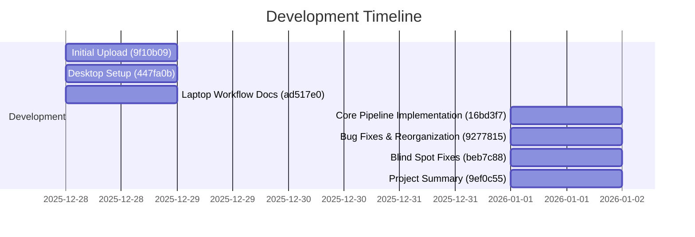

# Bioinformatics Pipeline - Project Status Review

**Review Date:** January 5, 2026  
**Reviewer:** AI Assistant  
**Project:** [bioinfo_pipeline](https://github.com/AlvahZorea/bioinfo_pipeline)

---

## Executive Summary

This project is a **well-architected Snakemake-based bioinformatics pipeline** for bacterial and viral genome analysis with a sophisticated anomaly detection system. The development has been rapid and focused, progressing from initial design to a near-complete implementation in approximately one week. The project demonstrates strong software engineering practices and thoughtful design, though it remains untested in a production environment.

**Overall Assessment:** 🟢 **Good progress, approaching production readiness**

---

## Project History Timeline



### Commit-by-Commit History

| Date | Commit | Description |
|------|--------|-------------|
| Dec 28, 2025 | `9f10b09` | **Initial Upload** - First files added to repository |
| Dec 28, 2025 | `447fa0b` | **Desktop Setup** - Minimal desktop testing configuration |
| Dec 28, 2025 | `ad517e0` | **Laptop Workflow** - Setup docs and minimal laptop configuration |
| Jan 1, 2026 | `16bd3f7` | **Core Pipeline** - Full Snakemake pipeline with anomaly detection |
| Jan 1, 2026 | `9277815` | **Bug Fixes** - Fixed bugs and reorganized project structure |
| Jan 1, 2026 | `beb7c88` | **Blind Spot Fixes** - Synteny, intergenic, integrated elements, novel genes, minority species alerts |
| Jan 1, 2026 | `9ef0c55` | **Documentation** - Comprehensive project summary document |

---

## Current State

### ✅ What's Implemented

| Component | Status | Lines of Code | Notes |
|-----------|--------|---------------|-------|
| **Main Snakefile** | ✅ Complete | 231 | Clean entry point with module loading |
| **QC Module** (`qc.smk`) | ✅ Complete | ~489 | FastQC, fastp, Kraken2 contamination |
| **Assembly Module** (`assembly.smk`) | ✅ Complete | ~362 | SPAdes, Flye, Unicycler, polishing |
| **Identification Module** (`identification.smk`) | ✅ Complete | ~415 | Kraken2, fastANI, geNomad, CheckV |
| **Annotation Module** (`annotation.smk`) | ✅ Complete | ~253 | Bakta (bacterial), Pharokka (viral) |
| **AMR Module** (`amr.smk`) | ✅ Complete | ~154 | AMRFinderPlus integration |
| **Virulence Module** (`virulence.smk`) | ✅ Complete | ~167 | VFDB BLAST |
| **Mobile Elements** (`mobile_elements.smk`) | ✅ Complete | ~126 | MOB-suite |
| **Prophages** (`prophages.smk`) | ✅ Complete | ~122 | PhiSpy |
| **Anomaly Detection** (`anomaly.smk`) | ✅ Complete | **1,221** | Core module - comprehensive |
| **Report Generation** (`report.smk`) | ✅ Complete | **1,587** | Rich HTML with Plotly visualizations |
| **Common Functions** (`common.smk`) | ✅ Complete | ~210 | Helper functions |
| **Configuration** | ✅ Complete | 214 | Well-documented YAML configs |
| **Conda Environments** | ✅ Complete | 7 files | Per-module dependency management |
| **Documentation** | ✅ Complete | ~1,400 | README, plan, checklist, summary |
| **Preparation Scripts** | ✅ Complete | 2 scripts | Database download and validation |

**Total workflow code:** ~5,300+ lines of Snakemake rules and Python

### 🔬 Anomaly Detection Capabilities (Core Feature)

The anomaly detection module is particularly sophisticated:

1. **Reference Selection** - Mash-based closest reference finding + NCBI auto-download
2. **Structural Variant Detection** - MUMmer alignment with gap/deletion mapping
3. **Per-Gene Taxonomy** - BLAST each gene to identify foreign origin
4. **Novel Gene Flagging** - Genes with no hits or <50% identity
5. **Synteny Analysis** - Gene order comparison vs reference
6. **Intergenic Region Scanning** - Foreign regulatory elements
7. **Integrated Element Detection** - Plasmid backbone genes in chromosome
8. **Minority Species Alerts** - Mixed taxonomy detection
9. **Foreign Gene Clustering** - Adjacent foreign genes grouped

### 📊 Report Features

Self-contained HTML reports include:
- Circular genome maps with GC content and foreign gene highlighting
- Linear contig views with anomaly markers
- Interactive Plotly.js visualizations
- Severity-based anomaly alerts (low/medium/high)
- Comprehensive summary tables for all analysis modules

---

## Honest Assessment

### 🌟 Strengths

1. **Excellent Architecture**
   - Truly modular design - each module is a separate `.smk` file
   - Clean separation of concerns between rules and common functions
   - Configuration-driven with sensible defaults

2. **Comprehensive Anomaly Detection**
   - 9 different analysis components for detecting genomic modifications
   - Thoughtful approach to false positive reduction (clustering, thresholds)
   - Addresses real blind spots identified through theoretical scenario analysis

3. **Production-Ready Features**
   - Conda environment management for reproducibility
   - Graceful handling of optional modules
   - Report-only mode for existing outputs
   - Configurable parameters at every level

4. **Good Documentation**
   - Detailed PROJECT_SUMMARY.md with development history
   - Clear README with quick-start instructions
   - Preparation checklist for database setup
   - Inline code comments and docstrings

5. **Rapid Development**
   - Significant implementation completed in ~1 week
   - Shows systematic approach (design → implementation → blind spot analysis → fixes)

### ⚠️ Areas for Improvement

1. **No Automated Tests**
   ```
   ❌ Zero pytest/unittest files found
   ❌ No CI/CD pipeline (GitHub Actions)
   ❌ No validation against known test genomes
   ```

2. **Untested in Production**
   - Only tested with mock data and pre-existing outputs
   - Full pipeline run not yet validated end-to-end
   - No performance benchmarks

3. **Database Dependencies Are Blocking**
   - ~400GB of databases required (Kraken2, Bakta, BLAST nr/nt, etc.)
   - No databases currently downloaded
   - API fallbacks exist but are slow and rate-limited

4. **Error Handling Could Be Stronger**
   - Basic try/except in places
   - No structured logging
   - No retry logic for transient failures

5. **Missing Features**
   - No batch processing (multiple samples simultaneously)
   - No checkpoint/resume capability
   - No cluster execution support yet (SLURM, SGE)
   - Module 7 (Phylogenetic Analysis) is reserved but not implemented

### 🔴 Critical Gaps

| Gap | Impact | Mitigation |
|-----|--------|------------|
| No end-to-end testing | Cannot verify pipeline works as expected | Need full pipeline run with real data |
| Missing databases | Cannot run most analyses | Download databases on server |
| API helpers not production-ready | Slow, rate-limited | Meant only for laptop testing |

---

## Recommendations

### Immediate Actions (This Week)

1. **Download Essential Databases**
   ```bash
   # Priority order based on usage:
   1. Kraken2 standard (~100GB) - needed for QC, identification
   2. Bakta (~30GB) - needed for annotation
   3. AMRFinderPlus (~500MB) - needed for AMR
   4. VFDB (~100MB) - needed for virulence
   5. CheckV (~2GB) - needed for viral analysis
   ```

2. **Run First End-to-End Test**
   - Use a well-characterized bacterial isolate
   - Validate each module produces expected outputs
   - Check report generation works with real data

3. **Add Basic Validation Tests**
   - Create `tests/` directory
   - Add tests for `common.smk` helper functions
   - Add output format validation tests

### Short-Term (2-4 Weeks)

| Priority | Action | Effort |
|----------|--------|--------|
| High | Full pipeline validation with 3-4 test cases | 2-3 days |
| High | Add structured logging | 1 day |
| Medium | Add pytest test suite | 2-3 days |
| Medium | Performance profiling (identify slow steps) | 1 day |
| Medium | Improve error messages | 1 day |
| Low | Add GitHub Actions CI | 0.5 days |

### Medium-Term (1-3 Months)

1. **Batch Processing Support**
   - Allow processing multiple samples in one run
   - Comparative analysis across samples

2. **Cluster Execution**
   - Add SLURM/SGE profile configurations
   - Resource allocation per rule

3. **Containerization**
   - Docker/Singularity images
   - Reproducible execution environments

4. **Performance Optimization**
   - Consider DIAMOND instead of BLAST for faster protein searches
   - Parallelize per-gene taxonomy analysis
   - Cache reference genomes aggressively

### Long-Term Vision

```
┌─────────────────────────────────────────────────────────────────┐
│                    Production-Ready Pipeline                     │
├─────────────────────────────────────────────────────────────────┤
│  • Validated against known edited genomes                       │
│  • Automated CI/CD with test suites                             │
│  • Cluster-ready with SLURM/SGE profiles                        │
│  • Docker containers for all modules                            │
│  • Web interface for job submission (optional)                  │
│  • ML-enhanced anomaly detection                                │
│  • Interactive genome browser in reports                        │
└─────────────────────────────────────────────────────────────────┘
```

---

## File Structure Summary

```
bioinfo_pipeline/
├── Snakefile                    # Main entry (231 lines)
├── config/
│   ├── config.yaml              # Main config (214 lines)
│   ├── databases.yaml           # DB paths
│   └── test_sample.yaml         # Test config
├── workflow/
│   ├── rules/                   # 11 rule files (~5,300 lines total)
│   │   ├── common.smk
│   │   ├── qc.smk
│   │   ├── assembly.smk
│   │   ├── identification.smk
│   │   ├── annotation.smk
│   │   ├── amr.smk
│   │   ├── virulence.smk
│   │   ├── mobile_elements.smk
│   │   ├── prophages.smk
│   │   ├── anomaly.smk          # Core module (1,221 lines)
│   │   └── report.smk           # Report gen (1,587 lines)
│   └── envs/                    # 7 conda environment files
├── scripts/
│   ├── api_helpers/             # API-based fallbacks
│   └── *.py                     # Helper scripts
├── docs/
│   ├── pipeline_plan.md
│   └── preparation_checklist.md
├── preparation_scripts/
│   ├── download_databases.sh
│   └── validate_installation.sh
├── PROJECT_SUMMARY.md           # Detailed project summary
└── README.md                    # Quick start guide
```

---

## Conclusion

This bioinformatics pipeline represents a **well-designed and thoughtfully implemented** solution for bacterial and viral genome analysis. The development trajectory has been impressive, moving from concept to near-complete implementation in about one week.

**Key Takeaways:**

1. ✅ **Architecture is solid** - modular, configurable, extensible
2. ✅ **Anomaly detection is comprehensive** - addresses real scientific needs
3. ✅ **Documentation is excellent** - rare in bioinformatics projects
4. ⚠️ **Testing is the major gap** - no automated tests, no production validation
5. ⚠️ **Database setup is blocking** - need to download before real use

**The project is 80% complete** - the remaining 20% involves validation, testing, and production hardening. The foundation is strong enough to support these final steps.

---

## Addendum: Pre-Deployment Preparation (Added January 5, 2026)

Following a detailed code audit, here are my updated recommendations for closing loose ends before deploying to your servers.

---

### 🔍 Code Audit Results

**Good news: All 9 blind spot fixes from the table exercises are verified as implemented:**

| Blind Spot | Rule Location | Status |
|------------|---------------|--------|
| Synteny Analysis | `anomaly.smk:388` - `synteny_analysis` | ✅ Implemented |
| Intergenic Scanning | `anomaly.smk:529` - `extract_intergenic` | ✅ Implemented |
| Integrated Elements | `anomaly.smk:703` - `detect_integrated_elements` | ✅ Implemented |
| Deletion → Gene Mapping | `anomaly.smk:341-374` in `nucmer_align` | ✅ Implemented |
| Novel Gene Flagging | `anomaly.smk:954-975` in `blast_genes` | ✅ Implemented |
| Minority Species Alert | `identification.smk:72-128` | ✅ Implemented |
| Foreign Gene Clustering | `anomaly.smk:1060-1102` in `aggregate_anomalies` | ✅ Implemented |
| NCBI Reference Download | `anomaly.smk:108` - `download_reference_ncbi` | ✅ Implemented |
| Report Enhancements | `report.smk:719-1341` | ✅ Implemented |

**No TODO/FIXME markers found in codebase** ✅

---

### ⚠️ Potential Edge Cases to Watch

Based on the code audit, here are edge cases that should be monitored during testing:

#### 1. GFF Parsing Robustness
```
Location: Multiple files (anomaly.smk, report.smk)
Issue: GFF attribute parsing assumes '=' separator format
Affected: attrs = dict(x.split('=') for x in parts[8].split(';') if '=' in x)
Risk: Malformed GFF files may cause parsing failures
```

**Recommendation:** Test with various GFF formats, especially those from different annotation tools.

#### 2. Database Path Validation
```
Location: anomaly.smk:897, 632
Issue: Checks for database file + ".phr" or ".nal" suffix
Risk: If database is in different format, BLAST won't run
```

**Recommendation:** Run `validate_installation.sh` before each analysis.

#### 3. Empty Reference Handling
```
Location: anomaly.smk:288, 420, 627
Issue: Creates empty output files when reference not found
Risk: Downstream rules may fail silently
```

**Recommendation:** Check `reference_info.json` and `download_info.json` status fields early.

#### 4. Large Genome Memory
```
Location: Gene BLAST in anomaly.smk:899-907
Issue: BLAST of all genes against nr can be slow/memory-intensive
Risk: May timeout or OOM on large genomes
```

**Recommendation:** Start with smaller test genomes; consider DIAMOND for production.

---

### 📋 Pre-Deployment Checklist

Complete these items in order before attempting a full pipeline run:

#### Phase 1: Environment Setup (Day 1)

- [ ] **Verify Snakemake installation**
  ```bash
  snakemake --version  # Should be >= 7.0
  ```

- [ ] **Verify Conda/Mamba availability**
  ```bash
  conda --version
  mamba --version  # Optional, faster than conda
  ```

- [ ] **Test conda environment creation**
  ```bash
  cd bioinfo_pipeline
  snakemake --use-conda --conda-create-envs-only -n
  ```

#### Phase 2: Database Downloads (Days 1-3)

Download in this priority order (highest impact first):

| Priority | Database | Size | Command | Required For |
|----------|----------|------|---------|--------------|
| 1 | Kraken2 Standard | ~100GB | `kraken2-build --standard --threads 16 --db /path/to/kraken2` | QC, Identification |
| 2 | Bakta | ~30GB | `bakta_db download --output /path/to/bakta --type full` | Annotation |
| 3 | RefSeq Mash Sketches | ~10GB | Download from NCBI RefSeq | Anomaly reference |
| 4 | NCBI nr/nt | ~200GB | `update_blastdb.pl --decompress nr nt` | Gene taxonomy |
| 5 | AMRFinderPlus | ~500MB | `amrfinder_update -d /path/to/amrfinder` | AMR detection |
| 6 | VFDB | ~100MB | Download + `makeblastdb` | Virulence |
| 7 | geNomad | ~3GB | `genomad download-database /path/to/genomad` | Virus/plasmid ID |
| 8 | CheckV | ~2GB | `checkv download_database /path/to/checkv` | Viral QC |
| 9 | MOB-suite | ~5GB | Included with MOB-suite install | Mobile elements |
| 10 | PhiSpy | N/A | Included with PhiSpy | Prophages |

**After downloading, update `config/databases.yaml`:**
```yaml
databases:
  kraken2:
    standard: "/path/to/kraken2/standard"
  bakta: "/path/to/bakta/db"
  refseq_mash: "/path/to/refseq/sketches.msh"
  nr: "/path/to/blast/nr"
  nt: "/path/to/blast/nt"
  amrfinder: "/path/to/amrfinder"
  vfdb: "/path/to/vfdb/vfdb_proteins"
  genomad: "/path/to/genomad/db"
  checkv: "/path/to/checkv/db"
  ncbi_cache: "/path/to/ncbi_cache"  # For downloaded references
```

#### Phase 3: Minimal Test Run (Day 3-4)

Test each module individually to isolate issues:

```bash
# 1. Test QC module only
snakemake --configfile config/test_sample.yaml \
  --config modules.assembly=false modules.identification=false \
          modules.annotation=false modules.amr=false \
          modules.virulence=false modules.mobile_elements=false \
          modules.prophages=false modules.anomaly=false \
          modules.report=false \
  --cores 8 --use-conda -n

# 2. If QC works, add Assembly
snakemake ... --config modules.assembly=true ...

# 3. Continue adding modules one by one
```

#### Phase 4: Full Pipeline Test (Days 4-5)

**Recommended test cases:**

| Test | Sample Type | Expected Outcome |
|------|-------------|------------------|
| TC1 | Well-characterized E. coli | Baseline - minimal anomalies |
| TC2 | Known pathogen with AMR | Should detect AMR genes |
| TC3 | Sample with known plasmid | Should detect mobile elements |
| TC4 | (If available) Engineered strain | Should trigger anomaly alerts |

**Full pipeline command:**
```bash
snakemake --configfile config/config.yaml \
  --config sample_id=test_ecoli \
           reads.short.r1=/path/to/reads_R1.fastq.gz \
           reads.short.r2=/path/to/reads_R2.fastq.gz \
  --cores 16 --use-conda \
  --rerun-incomplete \
  --keep-going
```

#### Phase 5: Validation (Day 5)

- [ ] Check output directory structure is complete
- [ ] Verify `genome_report.html` is generated and viewable
- [ ] Compare detected features against ground truth
- [ ] Check `anomaly_summary.json` for expected anomaly types
- [ ] Review logs in `00_logs/` for any warnings

---

### 🚀 Updated Recommendations

Given the solid codebase state, here's my revised priority order:

**Week 1: Focus on Infrastructure**
1. Database downloads (critical blocker)
2. Environment validation
3. Single module tests

**Week 2: Full Pipeline Validation**
1. End-to-end test with real sample
2. Compare results to expected outputs
3. Note any performance issues

**Week 3: Hardening**
1. Add error handling improvements if issues found
2. Document any workarounds needed
3. Consider creating test data fixtures for CI

---

### 💡 Pro Tips for Server Deployment

1. **Use a job scheduler wrapper:**
   ```bash
   # For SLURM
   snakemake --profile slurm_profile/
   ```

2. **Pre-download conda environments:**
   ```bash
   snakemake --use-conda --conda-create-envs-only --cores 1
   ```

3. **Use `--rerun-incomplete`:**
   If a job fails, this prevents re-running successful steps.

4. **Monitor with `--stats`:**
   ```bash
   snakemake ... --stats stats.json
   ```

5. **For large databases, use symlinks:**
   ```bash
   ln -s /shared/databases/kraken2 databases/kraken2
   ```

---

### ❓ Questions to Consider

Before running on production data:

1. **What's your reference genome strategy?** 
   - Always auto-download from NCBI?
   - Provide a curated reference library?
   - Allow user override in config?

2. **Anomaly threshold tuning:**
   - Current `foreign_gene_identity: 70` may need adjustment
   - `minority_species_threshold: 0.5` may be too sensitive for contaminated samples

3. **Performance expectations:**
   - Expected runtime per sample?
   - Memory limits on your server?
   - Number of concurrent samples?

---

*Updated: January 5, 2026, 3:04 PM*
*Next update: After server deployment testing*
